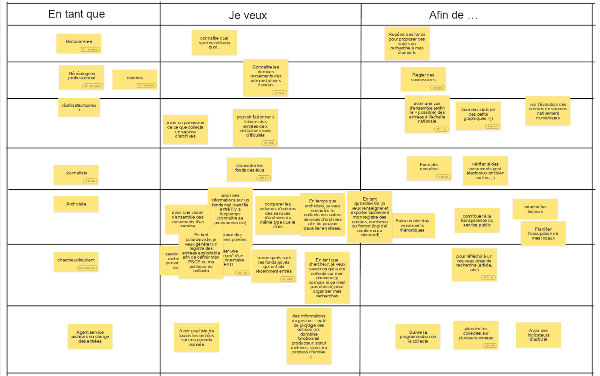

```{r, echo=FALSE}
library(metathis)
meta() %>% 
  meta_description(params$event) %>% 
  meta_name("github-repo" = paste0("datactivist/", params$slug)) %>% 
  meta_viewport() %>% 
  meta_social(
    title = params$title,
    url = paste0("https://datactivist.coop/", params$slug),
    image = params$image,
    image_alt = params$image_alt,
    og_type = "website",
    og_author = "Datactivist",
    og_locale = "fr_FR",
    og_site_name = "Datactivist",
    twitter_card_type = "summary",
    twitter_creator = "@datactivi_st")

```

layout: true

<style>
.remark-slide-number {
  position: inherit;
}

.remark-slide-number .progress-bar-container {
  position: absolute;
  bottom: 0;
  height: 4px;
  display: block;
  left: 0;
  right: 0;
}

.remark-slide-number .progress-bar {
  height: 100%;
  background-color: #e95459;
}

</style>


`r paste0("<div class='my-footer'><span>", params$event, "</span> <center><div class=logo><a href='https://datactivist.coop/'></a></div></center></span></div>")` 


---

class: center, middle

Ces slides en ligne : `r paste0("http://datactivist.coop/", params$slug)`

Sources : `r paste0("https://github.com/datactivist/", params$slug)`


Les productions de Datactivist sont librement réutilisables selon les termes de la licence [Creative Commons 4.0 BY-SA](https://creativecommons.org/licenses/by-sa/4.0/legalcode.fr).

<BR>
<BR>


---
### Rappel des enjeux autour du registres des entrées


* Différentes sources de données : logiciel métier, tableur

* Différents usages : à la fois outil de gestion interne, communication, connaissance

* Multiplicité des profils des usagers

* Pas d'harmonisation, formats et structures hétérogènes

---
### Rappel des cas d'usage identifiés



---
### Méthodologie

Regroupement des éléments dans une base [Airtable](https://airtable.com/shrfIOB70gsVUYB1b)

* **Recensement des sources de données** : producteurs, types de producteurs, source des données

* **Dépouillement des fichiers ** : compilation de tous les éléments présents dans les différents fichiers et tels qu'ils existent (par ex. "cote" et "cotation", même s'ils représentent la même chose. Ajout d'une description du champ, du type...

* ** Création de familles et de sous-familles** : ces éléments apparaissent assez rapidement une fois le travail d'identification effectué. Les familles et sous-familles permettent de voir les éléments importants du schéma. 

* **Exploration des jeux de données** avec l'outil [WTFCSV](https://www.databasic.io/en/wtfcsv/)

* **Réalisation d'une V0** à partir de ces éléments, en faisant apparaître les questions à discuter en COPIL.

---

<iframe class="airtable-embed" src="https://airtable.com/embed/shrTBPPBuRQ5ldUY3?backgroundColor=purple&viewControls=on" frameborder="0" onmousewheel="" width="100%" height="630" style="background: transparent; border: 1px solid #ccc;"></iframe>

---
class: inverse, center, middle

## Echanges autour du [projet de schéma](https://docs.google.com/spreadsheets/d/1GMw0vQKkXcWwOcZkIpK-AJX59LDIZWIpEO3RTCsflOo/edit?usp=sharing)


---
## Prochaines étapes

* Validation d'une V1 du schéma

* Documenter le schéma (métadonnées)

* Test de construction du schéma au format schema.org

* Organisation d'une consultation

* Proposition de communication

---
class: inverse, center, middle

# Merci !

Contact : [samuel@datactivist.coop](mailto:samuel@datactivist.coop), [annelaure@datactivist.coop](mailto:annelaure@datactivist.coop)


