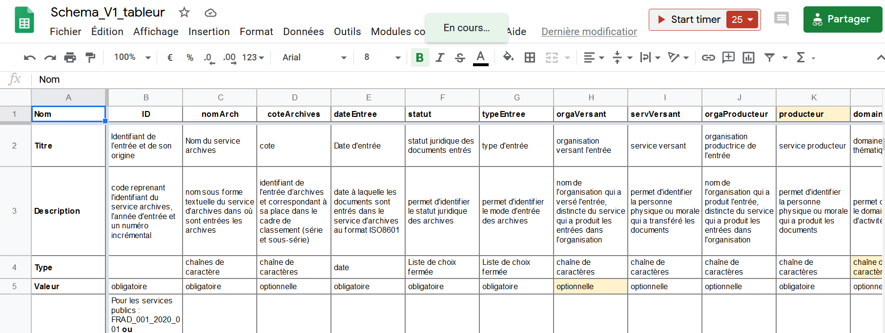
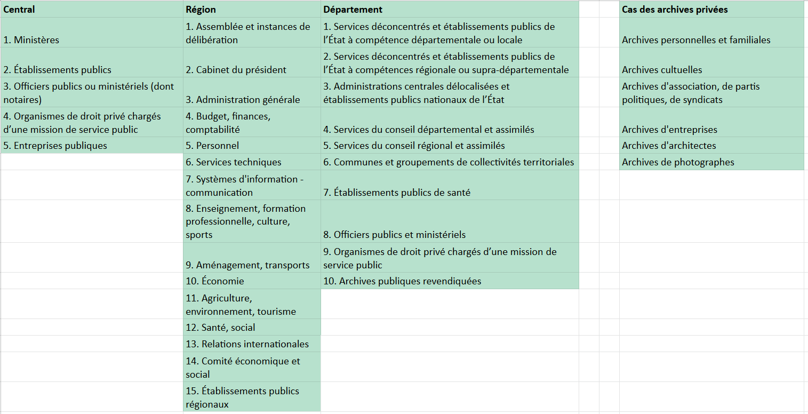
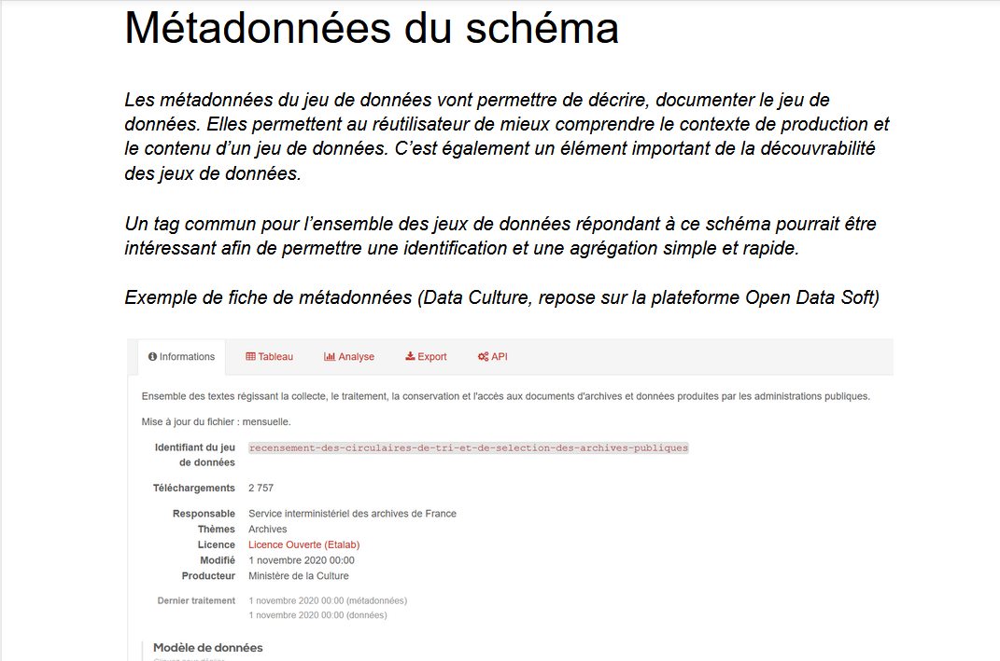

```{r, echo=FALSE}
library(metathis)
meta() %>% 
  meta_description(params$event) %>% 
  meta_name("github-repo" = paste0("datactivist/", params$slug)) %>% 
  meta_viewport() %>% 
  meta_social(
    title = params$title,
    url = paste0("https://datactivist.coop/", params$slug),
    image = params$image,
    image_alt = params$image_alt,
    og_type = "website",
    og_author = "Datactivist",
    og_locale = "fr_FR",
    og_site_name = "Datactivist",
    twitter_card_type = "summary",
    twitter_creator = "@datactivi_st")

```

layout: true

<style>
.remark-slide-number {
  position: inherit;
}

.remark-slide-number .progress-bar-container {
  position: absolute;
  bottom: 0;
  height: 4px;
  display: block;
  left: 0;
  right: 0;
}

.remark-slide-number .progress-bar {
  height: 100%;
  background-color: #e95459;
}

</style>


`r paste0("<div class='my-footer'><span>", params$event, "</span> <center><div class=logo><a href='https://datactivist.coop/'></a></div></center></span></div>")` 


---

class: center, middle

Ces slides en ligne : `r paste0("http://datactivist.coop/", params$slug)`

Sources : `r paste0("https://github.com/datactivist/", params$slug)`


Les productions de Datactivist sont librement réutilisables selon les termes de la licence [Creative Commons 4.0 BY-SA](https://creativecommons.org/licenses/by-sa/4.0/legalcode.fr).

<BR>
<BR>


---
## Point d'étape : travail réalisé depuis le dernier COPIL

**Modification du projet de schéma avec :**

* Eléments du précédent COPIL 

* Eléments reçus par mail ou en commentaires du document partagé


---
## Point d'étape : travail réalisé depuis le dernier COPIL

**Aspects à trancher :**
* Retour sur l'ID :

> Pour les services publics : FRAD_001_2020_001 ou 22231_2020_001 (22231 étant le naan des AD01), pour les entreprises SIREN_2020_001

* Suppression des dernières colonnes

---
## Point d'étape : travail réalisé depuis le dernier COPIL

* Domaine du producteur : quelle liste de termes?


---
## Point d'étape : travail réalisé depuis le dernier COPIL

**Réalisation d'une première version de métadonnées**

(https://docs.google.com/document/d/1vGtfVluJQnWa95pj4YOuhTN95demcmg9Zz_lpxefAqg/edit?usp=sharing)

---
## Prochaines étapes

**Finalisation du schéma et de la documentation (novembre)**

**Phase d'appel à commentaires (décembre)**
* Auprès des archivistes via un doc transmis par canaux de diffusion habituels (Liste SIAF et AAF)
* Auprès des communautés techniques via schema.data.gouv et relai Team Open Data

**Prise en compte des commentaires et publication (janvier)**

---
class: inverse, center, middle

# Merci !

Contact : [annelaure@datactivist.coop](mailto:annelaure@datactivist.coop), [samuel@datactivist.coop](mailto:samuel@datactivist.coop)


