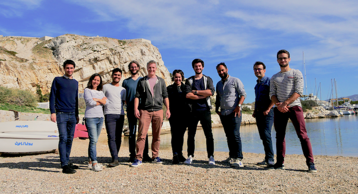

layout: true

`r paste0("
", params$event, " 

")` 

---

class: center, middle

Ces slides en ligne : `r paste0("http://datactivist.coop/", params$slug)`

Sources : `r paste0("https://github.com/datactivist/", params$slug)`

Les productions de Datactivist sont librement réutilisables selon les termes de la licence [Creative Commons 4.0 BY-SA](https://creativecommons.org/licenses/by-sa/4.0/legalcode.fr).

 
 

---
## Qui sommes nous ?

### We .red[open data], we make them .red[useful]

---
## Qui sommes nous ?

- Datactivist est un .red[**pure player de l’open data**] créé en 2016, par Samuel Goëta et Joël Gombin.

- Se positionnant sur .red[**toutes les étapes du travail d’ouverture des données**], Datactivist travaille tant avec les producteurs de données qu’avec les réutilisateurs et participe à l’appropriation des données par chacun.

- Nous appliquons nos propres .red[**valeurs**] : nous sommes une coopérative ; nos supports de formation et nos contenus sont librement réutilisables, publiés en licence Creative Commons.

- Une approche issue de la recherche : voir notamment **https://datactivist.coop/these**. 

- Nous animons la communauté [#TeamOpenData](https://teamopendata.org).

---
## Nos activités

- Conseil sur les .red[**stratégies d’ouverture de données**] : nous aidons les organisations dans la conception et la mise en œuvre de leur stratégie d’ouverture de données.

- .red[**Accompagnement dans la réutilisation de données ouvertes**] : nous aidons les organisations à utiliser les données au quotidien. 

- .red[**Sensibilisation et formation à la donnée**] : nous formons à la culture générale des données, nous enseignons les grands principes et bonnes pratiques de l'open data et nous introduisons à la data science. 

- .red[**Médiation de données**] : nous organisons des hackathons, des open data camps, des expéditions de données...

???

La médiation de données est aussi fondamentalement une animation de communauté(s). 

---
## Notre vision

### D'un open data de l'offre à un .red[open data de la demande]

Aujourd’hui, les administrations choisissent les données à ouvrir, elles décident du quand et du comment .red[**sans consulter les usagers**].

Les rares données ouvertes sont souvent décevantes : pas à jour, trop agrégées, mal documentées, mal formatées, parfois inutilisables. 

Il faut aujourd’hui passer à l’étape supérieure : .red[**un open data piloté par la demande**].

Mais c'est difficile : demande peu visible, pas de possibilité de soumettre la communication des données à l'expression d'une demande. Leviers : demandes d'ouverture, plateformes, animations (ex : hackathon), gouvernance partagée... 

---
## Rappel de la demande et objectifs

* Définir un schéma de données pour la publication en open data des registres d'entrées
* Réfléchir aux utilisations et visualisations possibles

.red[**Pourquoi faire un schéma?**]
* Permet de mieux documenter les jeux de données
* Permet d'harmoniser les jeux de données
* Permet de faciliter l'exploitation des jeux de données (agrégation, consolidation, traitements automatisés)

---
## Préconisations pour un schéma efficace
* Définition et respect de règles de formatage des fichiers (format, séparateur, encodage)
* Nommage des fichiers normalisés
* Travail sur la structures des champs (nom) et le contenu des champs (cardinalité et type de contenu)

.red[[**Exemple** sur schema.data.gouv](https://schema.data.gouv.fr/metis-reseaux/infos-travaux/latest.html)] 

---
## Méthodologie envisagée et étapes / échéances

**Basée sur la [méthodologie de schema.data.gouv](https://guides.etalab.gouv.fr/producteurs-schemas/#a-qui-s-adresse-ce-guide)**

---
## Atelier sur les cas d'usages

---
## Rapport d'étonnement sur les premiers fichiers reçus
### .red[Analyse générale]

---
## Rapport d'étonnement sur les premiers fichiers reçus

---
## Rapport d'étonnement sur les premiers fichiers reçus
### .red[Analyse des fichiers]

* Peu d'usage de nomenclature
* Problématique des dates
* Une centaine de champs différents...mais des grandes familles qui se dégagent
* La plupart des champs sont des champs textuels

---
## Questions / arbitrages
* Définir le registre d'entrée tel qu'il doit être publié
* Validation d'un schéma en csv

---
## Prochaines étapes

---
class: inverse, center, middle

# Merci !

Contact : [samuel@datactivist.coop](mailto:samuel@datactivist.coop), [annelaure@datactivist.coop](mailto:annelaure@datactivist.coop)

